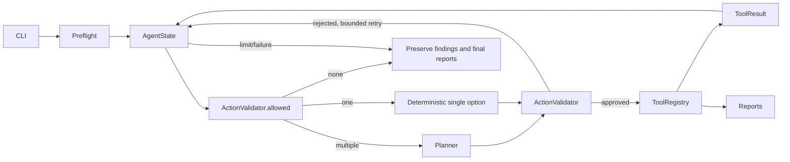

# Architecture — 0.4.1

## Application layers

```text
CLI ───────────────┐
Guided Scan ───────┼── RunService ── fixed scan / controlled Agent runtime
Chat Intent Layer ┘                         │
                                    ActionValidator
                                           │
                                      ToolRegistry
                                           │
                                    Semgrep / Nuclei
                                           │
                            Finding → enrichment → brief → artifacts
```

`service.py` owns strict RunRequest/RunResult, benchmark resolution, preflight,
settings, paths/state initialization and calls to the existing loops. CLI is an
adapter; FastAPI calls this Python service directly, never a subprocess CLI.
`benchmarks.py` loads application-owned `config/benchmarks.yaml`. Only enabled
reviewed service hosts extend the loopback allowlist. UI requests and LLM output
cannot modify the registry. Benchmark source paths stay beneath the targets
mount; direct CLI retains its validated local-path contract.

`web.py` provides same-origin Jinja2/vanilla-JS/local-CSS presentation. POSTs
require a per-process CSRF token; Host/Origin checks resist DNS rebinding and
cross-site access. No CORS, remote assets, HTML rendering of findings or raw log
download. Report downloads have a fixed allowlist and contained validated run
paths. Keys remain server-side. UI/agent share a non-root image; neither mounts
the Docker socket. Only host wrappers start lab services.

`jobs.py` owns one background thread at a time behind a lock. It retains 50 jobs
and 100 typed events/job. `events.py` reports creation, stage start/completion/
warning and completion; observer failures cannot break scanning. No console
parsing or durable queue. After restart use `repository.py` to browse surviving
artifacts. Repository supports old summaries without benchmark metadata, skips
malformed history, and limits listings to 500 runs. Separate CLI processes remain
independent of the UI lock. Reports in progress may be briefly unreadable.

### Chat is not Planner

`chat.py` routes a closed intent enum; `chat_analysis.py` is a separate read-only
analyst. The browser explicitly sends selected run_id/finding_id; repository
validation happens before provider access. Latest readable run is only a fallback
when no context is supplied. Within the same timestamp second, history uses
filesystem modification time rather than random suffix order.

```text
Question -> Intent -> validated selected run/finding -> compact stored projection
                                                       -> Chat Run Analyst
                                                       -> strict prose/ID schema
START_SCAN -> reviewed benchmark proposal -> explicit confirmation -> JobManager
```

The analyst receives at most 50 severity-ranked findings, with the selected finding
first. Fields are ID/title/source/tool/severity/normalized category and bounded
description/recommendation/rationale, plus aggregate run metadata. No raw logs,
source, locations, evidence or environment. Structured summary <=350 characters;
confirmed_points, assumptions_or_manual_checks, remediation_priorities contain
at most seven points total (<=180 characters each, <=4 per block). Legacy answer
<=1800 characters remains accepted. <=7 unique provided IDs, <=4 caveats/questions;
extra fields and unknown IDs fail validation.
It does not instantiate Findings, write reports, call Planner or access tools.

Only analyst truncation has a single explicit concise retry (2400/3600 tokens,
LLM_CHAT_MAX_TOKENS / LLM_CHAT_RETRY_MAX_TOKENS). Transport still never retries
chat requests. A dedicated safe exception temporarily carries redacted content,
not provider reasoning or tool calls; its message contains only a fixed code.
An isolated partial-JSON decoder recovers bounded display fields, without ID
links. If retry fails, useful partial text returns completed_with_warnings /
chat_response_truncated and UI actions, not a discarded response. When retry
succeeds, the first partial remains expandable. No content is persisted into
scan artifacts. Complete outputs retain strict Pydantic validation.

Follow-ups are fixed read-only modes bound to the original run/finding. Up to
2400 characters of previously displayed text are untrusted ephemeral context,
never Planner/tool input. Stored severity and enrichment status are rendered
independently; narrow contradiction guards supplement the prompt, not a general
natural-language proof of correctness or exploitability.

Intent parser role `chat` and analyst role `chat_analysis` have separate
in-memory counters and zero hidden transport retries. Both explicit analyst
attempts count toward its usage. Chat usage never changes the original
run's summary. Content failures preserve connectivity=available; timeout, HTTP,
rate-limit and discovery failures require another explicit check. Chat's health
indicator is explicitly separate from scan outcomes. RunService still performs
its own authoritative provider preflight.

Scan proposals contain an immutable RunRequest, stored server-side under a random
one-use token (at most 50, five-minute lifetime). Confirmation has a separate
strict contract and CSRF-protected endpoint, not a model-accessible intent.
Cancellation consumes the token. Confirmation revalidates through JobManager;
concurrent/replayed/expired requests cannot start duplicate jobs. Proposals are
ephemeral, like the last 30 displayed chat messages; neither becomes Planner input.

For `demo-full`, the mounted source and HTTP service are the same project. The
constant HTTP server never imports the deliberately unsafe source-only examples.
Summary/report/brief receive trusted same-application metadata. Legacy arbitrary
source/target pairs retain their identity warning. Registry expected-findings
files evaluate both scanner sources with stable tool/title/source/category keys;
partial scopes filter the expected baseline. This is curated fixture coverage,
not real-world precision or proof of exploitability.

## Preserved controlled agent core



The deterministic pipeline is CLI → fixed scanner sequence → parsers → Finding
→ optional failure-isolated enrichment → optional AI brief → reports. `scan` and `agent` commands share tools and
normalization. Legacy flag-only CLI retains compatibility; it does not invoke
the planner.

Plain Python was selected over LangGraph: six closed actions and a bounded
loop fit explicit code without framework state coercion or generic tool calling.
Planner, FindingAnalyzer and brief synthesis reuse OpenAICompatibleClient transport but
have different prompts, schemas and counters. Planner JSON has only an enum
action and short reason. Finding analysis has only four editable fields plus
short rationale. No generic execution function is exposed to either role.

Trust boundaries:

1. CLI input is validated before creating scanner actions. Target allowlist is
   local-only; source must exist and cannot be a root/UNC/network path.
2. Planner input is an explicit projection, never state serialization. URLs,
   paths, finding content, raw logs and environment values are excluded.
3. All proposed actions pass the validator. Completed/failed/running scans cannot
   run again. Enrichment follows terminal scanner stages; brief follows terminal
   enrichment; report follows terminal brief; FINISH requires a report or terminal
   report failure. Disabled optional stages are explicitly skipped.
4. Registry owns scanner arguments. Scanners run fixed local rules/templates;
   source is read-only in Compose. No subprocess arguments come from the model.
5. Only parsed scanner records create Finding objects. Enrichment uses an explicit
   update allowlist, exact batch IDs and immutable scanner categories.
6. Raw output is local to the run. Trace contains only validated action names,
   short explicit reasons and application-generated safe errors. Exceptions and
   provider chain-of-thought are not dumped into state/logs.

Successful operations update state through ToolResult. Failure keeps prior
findings. Three consecutive bad/unavailable planner decisions terminate; total
executed steps and actual Planner HTTP completion attempts each default to eight.
Only multiple allowed actions invoke Planner. Single-option transitions consume
no Planner calls or tokens and continue even when that request budget is used.
Planner retries belong only to the loop (no hidden HTTP retries); enrichment
transport retries timeout/429/5xx at most twice. Every attempted completion is
counted, but failed network calls may have no provider token count.
Shared JSON extraction accepts one unambiguous object (including a fenced block)
before strict Pydantic validation; duplicate keys and multiple objects are rejected.
Application-authored error codes classify transport, parsing, schema and identity
failures without retaining provider content or validation input values.
Finalization is deterministic application code, outside
the planner budget, and attempts to write partial reports on any terminal path.

Each new command creates a UTC-format unique directory and atomically replaces
`runs/latest.json`. Simultaneous runs never share raw/report files. The latest
pointer names the most recently started run. The UI has a single in-process
worker; checkpoint resumption is not implemented.

Summary retains status=failed for scanner/planner/report failures, distinguishing
completed_with_failures from aborted execution via finish_reason/outcome. Optional
enrichment or brief failures instead produce completed_with_warnings (exit 0),
without masking fatal failures. Reports
show each stage, SAST source and DAST target independently; the educational
defaults refer to different applications. Trace includes decision_source and
error_code. The read-only latest command resolves the portable run pointer.

## Optional analysis (introduced in v0.3.2, refined in v0.4.1)

`enrichment.py` commits each successful unit independently. Default batch size is
one. Experimental batches are atomic, with failures confined to that batch.
Truncation gets one content retry with the configured larger max_tokens; other
schema/content failures preserve the unit's scanner objects and continue. Strict
identity/count/category invariants remain. EnrichmentStats records requested,
completed, failed, retried and safe finding_id/error_code entries. A single
ENRICH_FINDINGS trace action represents the whole stage.

`brief.py` projects counts/stage metadata and compact normalized descriptions,
excluding evidence, locations, target/source, raw refs and environment. The
fixed GENERATE_AI_BRIEF action uses a strict small AIBrief schema, validates that
top references are existing IDs without duplicates, and never mutates findings.
Tone/language are enums mapped to fixed instructions, never arbitrary prompts.
Truncation receives at most one larger-budget concise retry; JSON/schema or ID
validation failures receive one terminal schema repair using original data and
safe diagnostics. At most three logical Brief attempts; no retry after repair.
The state retains bounded `brief_attempts`, serialized to
`summary.llm_components.brief.attempts` on both success and failure. Separate usage counters
cover planner, enrichment, brief and their sum.

Reports show the brief near the top; ai_brief.json stores validated fields or a
small status object. Console outputs only the headline/summary and report paths.
Technical finding enrichment never receives tone instructions. A failed brief
still permits report generation. No-LLM skips both optional analysis stages.
Legacy flag-only commands/helper APIs retain their compatibility contract; the
v0.3.2 optional-analysis workflow belongs to the scan/agent subcommands.
## v0.4.1 presentation and reliability

Planner uses Settings budgets 320/512 (256–2048); only the immediately preceding
planner_response_truncated rejection selects the larger budget. The existing loop
owns attempt limits, trace rejection records and usage accounting. Single-option
steps remain deterministic. Reasoning stays one short sentence.

Brief input descriptions are <=120 characters; output headline/summary/why/step/
limitations/closing limits are 100/450/180/180/300/160, with three IDs and four steps.
Its 2000/3200 budgets, one truncation retry and one terminal schema repair preserve successful enrichment and
normal reports on failure. Tone affects only the brief. No detector logic changed.

`llm_components` supplements legacy llm_status with independent planner,
enrichment and brief outcomes. `presentation.py` derives Russian UI banners from
actual stages; it never equates brief failure with AI being disabled. Repository
reads project UI text without rewriting older reports. Registry description_ru
and file-derived baseline counts feed UI cards, not hardcoded per-ID translations.
