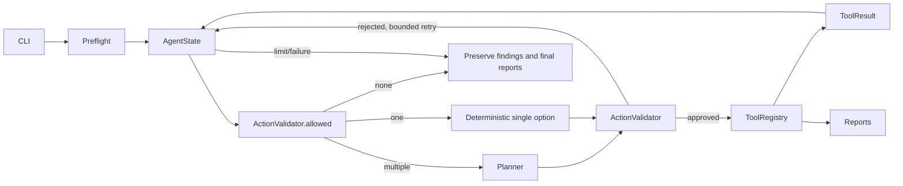

# Architecture — 0.3.2

The deterministic pipeline is CLI → fixed scanner sequence → parsers → Finding
→ optional failure-isolated enrichment → optional AI brief → reports. `scan` and `agent` commands share tools and
normalization. Legacy flag-only CLI retains compatibility; it does not invoke
the planner.

Plain Python was selected over LangGraph: six closed actions and a bounded
loop fit explicit code without framework state coercion or generic tool calling.
Planner, FindingAnalyzer and brief synthesis reuse OpenAICompatibleClient transport but
have different prompts, schemas and counters. Planner JSON has only an enum
action and short reason. Finding analysis has only four editable fields plus
short rationale. No generic execution function is exposed to either role.

Trust boundaries:

1. CLI input is validated before creating scanner actions. Target allowlist is
   local-only; source must exist and cannot be a root/UNC/network path.
2. Planner input is an explicit projection, never state serialization. URLs,
   paths, finding content, raw logs and environment values are excluded.
3. All proposed actions pass the validator. Completed/failed/running scans cannot
   run again. Enrichment follows terminal scanner stages; brief follows terminal
   enrichment; report follows terminal brief; FINISH requires a report or terminal
   report failure. Disabled optional stages are explicitly skipped.
4. Registry owns scanner arguments. Scanners run fixed local rules/templates;
   source is read-only in Compose. No subprocess arguments come from the model.
5. Only parsed scanner records create Finding objects. Enrichment uses an explicit
   update allowlist, exact batch IDs and immutable scanner categories.
6. Raw output is local to the run. Trace contains only validated action names,
   short explicit reasons and application-generated safe errors. Exceptions and
   provider chain-of-thought are not dumped into state/logs.

Successful operations update state through ToolResult. Failure keeps prior
findings. Three consecutive bad/unavailable planner decisions terminate; total
executed steps and actual Planner HTTP completion attempts each default to eight.
Only multiple allowed actions invoke Planner. Single-option transitions consume
no Planner calls or tokens and continue even when that request budget is used.
Planner retries belong only to the loop (no hidden HTTP retries); enrichment
transport retries timeout/429/5xx at most twice. Every attempted completion is
counted, but failed network calls may have no provider token count.
Shared JSON extraction accepts one unambiguous object (including a fenced block)
before strict Pydantic validation; duplicate keys and multiple objects are rejected.
Application-authored error codes classify transport, parsing, schema and identity
failures without retaining provider content or validation input values.
Finalization is deterministic application code, outside
the planner budget, and attempts to write partial reports on any terminal path.

Each new command creates a UTC-format unique directory and atomically replaces
`runs/latest.json`. Simultaneous runs never share raw/report files. The latest
pointer names the most recently started run. No background worker or checkpoint
resumption is implemented.

Summary retains status=failed for scanner/planner/report failures, distinguishing
completed_with_failures from aborted execution via finish_reason/outcome. Optional
enrichment or brief failures instead produce completed_with_warnings (exit 0),
without masking fatal failures. Reports
show each stage, SAST source and DAST target independently; the educational
defaults refer to different applications. Trace includes decision_source and
error_code. The read-only latest command resolves the portable run pointer.

## v0.3.2 optional analysis

`enrichment.py` commits each successful unit independently. Default batch size is
one. Experimental batches are atomic, with failures confined to that batch.
Truncation gets one content retry with the configured larger max_tokens; other
schema/content failures preserve the unit's scanner objects and continue. Strict
identity/count/category invariants remain. EnrichmentStats records requested,
completed, failed, retried and safe finding_id/error_code entries. A single
ENRICH_FINDINGS trace action represents the whole stage.

`brief.py` projects counts/stage metadata and compact normalized descriptions,
excluding evidence, locations, target/source, raw refs and environment. The
fixed GENERATE_AI_BRIEF action uses a strict small AIBrief schema, validates that
top references are existing IDs without duplicates, and never mutates findings.
Tone/language are enums mapped to fixed instructions, never arbitrary prompts.
Truncation receives at most one larger-budget retry. Separate usage counters
cover planner, enrichment, brief and their sum.

Reports show the brief near the top; ai_brief.json stores validated fields or a
small status object. Console outputs only the headline/summary and report paths.
Technical finding enrichment never receives tone instructions. A failed brief
still permits report generation. No-LLM skips both optional analysis stages.
Legacy flag-only commands/helper APIs retain their compatibility contract; the
v0.3.2 optional-analysis workflow belongs to the scan/agent subcommands.
